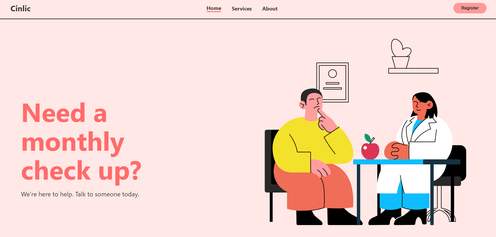

# Clinic Management System



## Description

Cinlic is revolutionizing healthcare accessibility by providing a seamless platform where anyone,
regardless of their age or location, can connect with healthcare professionals. Our platform enables
users to search for doctors, book appointments, and complete payments online, all in one place.
We believe that quality healthcare should be easily accessible to everyone, and our platform is
designed to bridge the gap between patients and healthcare providers through technology.


## Setup Instructions

There are **two ways** to set up the Clinic Management System: using **WAMP/XAMPP** or **Docker**.

### 1. Setup Using WAMP/XAMPP

#### Requirements:
- WAMP or XAMPP server installed on your local machine.
- MySQL running on port 3306 (default) with **user: clinic_user** and  **password: pass** set.
- An IDE (VSCode, NetBeans, PHPStorm, etc.).

#### Steps:
1. Clone the repository into your WAMP or XAMPP `www` directory:
   ```bash
   git clone https://github.com/OOD-2024/GIN446.git
   ```
2. Start the WAMP/XAMPP server to run Apache and MySQL.

3. Import the database schema by running the `db.sql` file:
   - If using phpMyAdmin:  
     1. Navigate to the **Import** tab.  
     2. Select the `db.sql` file from the cloned repository.  
     3. Click **Go** to execute.
   - If using the MySQL CLI:
     ```bash
     mysql -u root clinic < /path/to/db.sql
     ```

5. Modify the database connection settings if needed by editing `includes/dbh.inc.php`.

### 2. Setup Using Docker
using Docker there is no more need to donwload WAMP or MYSQL database on local machine. these functionalities are provided through MYSQL, PHP, AND PHPADMIN CONTAINERS 

#### Requirements:
- Docker and Docker Compose installed.

#### Steps:
1. Clone the repository:
      ```bash
      git clone https://github.com/OOD-2024/GIN446.git
      cd your-repo-folder
      ```
2. Run Docker Compose to build and start the containers:
      ```bash
      docker-compose up -d  # or docker compose up -d
      ```

3. Access the application by navigating to `http://localhost` in your browser. port 8081 for phpadmin and port 8080 for web page. Also note port 3306 should be availabe for MYSQL container
## How to Use

### For Patients

1. Initial access is limited to guest privileges (no appointment booking or profile access)
2. To create an account:
   - Click "Register" in the top right corner
   - Select "Create Account"
   - Fill in your details
3. Login with your credentials
4. After logging in, you can:
   - Book appointments
   - Access your profile page
   - Apply to become a doctor
5. If you want to access the admin page doctorapprove.php your ID should be 117 , 137 or 7 if you want to change these ids head to the doctorapprove.php and change the values inside 'admins' array

### For Doctors

- Doctors can apply through the platform to join the medical community
- Once approved, they can manage appointments and patient records

## Key Features

1. Easy Connection with Local Doctors
   - Find and book appointments with doctors in your area
2. Medical History Access
   - View your diagnosis history
   - Access prescribed treatments
3. Doctor Registration
   - Medical professionals can join the platform
   - Help serve the local community

## Future Features

Check our GitHub issues page for upcoming features and enhancements. Stay tuned!

## Contributing

Feel free to contribute to this project. Check our GitHub issues for areas where help is needed.

If you encounter any issues or have questions, please open an issue on our GitHub repository.
